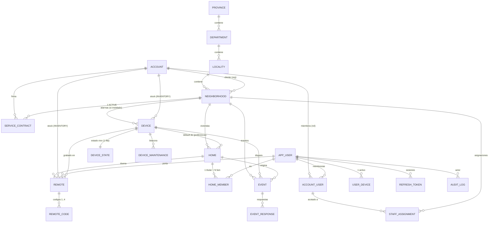

# Diseño de relaciones — Fase 1

> **Fecha:** 2026-07-16 · **Estado:** CERRADO e IMPLEMENTADO en `backend-nestjs`
> (modelo v2). Este documento conserva el **porqué** de cada decisión; el DDL vive
> en `esquema-postgres-v2.sql` y el estado del proyecto en `estado-proyecto.md`.
> **Base:** decisiones D1–D4 + modelo comercial (ver `relevamiento-fase0.md` §7).

---

## 1. Decisiones que fijan este diseño

| Decisión | Valor |
|---|---|
| Alarmas | Solo comunitarias, pertenecen al **barrio**. El hogar tiene controles remotos |
| Esquema PRIVADO | CPS gestiona la comunidad; contrata **la comunidad entera** (consorcio/grupo) |
| Esquema PÚBLICO | Contrata **solo la municipalidad**; los vecinos no pagan a CPS |
| Autogestión municipal | **Total**: la muni crea barrios, hogares, vecinos y personal. CPS se reserva equipos, config avanzada y transferencias |
| Firebase | Se elimina por completo. Canal de tiempo real propio sobre NestJS + PostgreSQL |
| Rol MONITOR | Se agrega |
| Inventario / provisioning | Se agrega (con claim codes) |

**Consecuencia estructural clave:** nadie contrata a nivel hogar. El acceso del vecino ya
no puede derivar de contratos → deriva de su **membresía al hogar** (§3.3).

---

## 2. Los tres dominios del sistema

```
┌─ PANEL WEB ──────────────────┐  ┌─ APP VECINOS ────────────┐  ┌─ DISPOSITIVOS ───────┐
│ CPS + organizaciones          │  │ titulares y familiares    │  │ alarmas comunitarias  │
│ login: username + password    │  │ login: DNI + OTP          │  │ auth: credencial por  │
│ acceso: account_user (RBAC)   │  │ acceso: home_member       │  │ equipo (provisioning) │
└──────────────────────────────┘  └──────────────────────────┘  └──────────────────────┘
```

Una sola tabla de personas (`app_user`) con **dos superficies de acceso**: membresías de
cuenta (panel) y membresías de hogar (app). Una persona puede tener ambas (el técnico de
CPS que además es vecino: una fila en `account_user` y una en `home_member`).

---

## 3. Cuentas, roles y acceso

### 3.1 `account` — solo quien administra o contrata

| type | subtype | quién es | gestión de sus barrios |
|---|---|---|---|
| COMPANY | — | CPS Security (única) | global |
| ORGANIZATION | MUNICIPAL | municipalidad | **se autogestiona** |
| ORGANIZATION | PRIVATE | consorcio / junta vecinal / barrio cerrado | **la gestiona CPS** |

- **Desaparece `account` tipo HOME** (§3.3). Toda comunidad tiene exactamente una
  organización cliente (muni o consorcio) — el modelo queda uniforme.
- `subtype` es informativo + fija el **default** de gestión; la gestión efectiva vive por
  barrio (`neighborhood.managed_by`, §4), lo que permite excepciones y transferencias.

### 3.2 `account_user` — roles del panel

Roles: **OWNER, ADMIN, TECHNICIAN, MONITOR** (matriz impuesta por CHECK + FK compuesta,
misma técnica actual):

| type | OWNER | ADMIN | TECHNICIAN | MONITOR |
|---|---|---|---|---|
| COMPANY | cuenta raíz CPS (poco uso, gestiona admins y políticas) | operación global | técnico CPS | operador de monitoreo global |
| ORGANIZATION | cuenta raíz del cliente (gestiona sus admins, seguridad) | operación de sus barrios | técnico de campo | operador de monitoreo |

- OWNER responde al PDF (Owner Municipal / Super Usuario): rol de **soberanía**, no de
  operación diaria. Único que crea/elimina ADMINs de su cuenta. 2FA obligatorio.
  Jerárquico: OWNER puede todo lo que puede ADMIN (estilo GitHub/Slack).
- MONITOR: solo lectura de estados + gestión de eventos (tomar, resolver, marcar falsa
  alarma). No crea usuarios ni toca configuración.

#### OWNER institucional, operación personal (patrón "cuenta root de AWS")

Decisión (2026-07-16): **el OWNER es un usuario INSTITUCIONAL**, no una persona. El
sistema se le vende a la municipalidad y el personal rota constantemente: atar la
soberanía de la cuenta a un empleado significa perder el control de la cuenta en cada
cambio de gestión. Es el mismo patrón que la cuenta root de AWS: pertenece a la
organización, se usa poco, y el día a día corre por usuarios personales.

Para que el usuario institucional no degenere en "la clave compartida que usan todos",
el diseño le pone guardas:

| Guarda | Regla |
|---|---|
| Tipo de usuario | `app_user.kind = INSTITUTIONAL` (vs `PERSON`). Sin DNI, sin datos personales: nombre = cargo/institución |
| Uso restringido | Solo actos de soberanía: crear/eliminar ADMINs, políticas de seguridad, aceptar transferencias. **No opera** barrios, hogares ni eventos |
| Rol permitido | Un INSTITUTIONAL solo puede ser OWNER (regla de servicio). Nunca home_member, nunca TECHNICIAN/MONITOR/ADMIN |
| Recuperación | Email **institucional** obligatorio (mesa de entradas / secretaría), nunca correo personal: la recuperación sigue a la institución, no al empleado |
| Traspaso | Cambio de gestión = rotar clave + re-enrolar 2FA. Es un acto formal y queda en `audit_log` |
| Auditoría | Todo login y toda acción del OWNER se auditan siempre (acción + IP + sesión). Como su uso es excepcional, la atribución por contexto es viable |
| Cardinalidad | **Exactamente un OWNER por cuenta** (índice único parcial) |

Los demás roles (ADMIN, TECHNICIAN, MONITOR) **siguen siendo personas reales con usuario
propio**: ahí sí la rotación se resuelve dando de baja al que se va (el OWNER lo hace en
un minuto), y la auditoría del trabajo diario necesita saber quién hizo qué.

#### Esquema de usuarios propuesto (ejemplo concreto)

```
account COMPANY "CPS Security"
├── OWNER      → usuario institucional "cps_root" (email institucional; 2FA; poco uso)
├── ADMIN      → operaciones/ingeniería CPS (personas reales)
├── TECHNICIAN → instaladores CPS
└── MONITOR    → operadores de la central de monitoreo CPS

account ORGANIZATION/MUNICIPAL "Municipalidad de San Pedro"
├── OWNER      → usuario institucional "muni_sanpedro" (sobrevive a los cambios de
│                gestión; crea/da de baja admins; 2FA re-enrolable en cada traspaso)
├── ADMIN      → operadores reales del municipio (ej. ALE_COPA)
├── TECHNICIAN → técnicos de campo municipales (acotables por barrio, §3.4)
└── MONITOR    → operadores del centro de monitoreo municipal (acotables por barrio)

account ORGANIZATION/PRIVATE "Consorcio Barrio Los Lapachos"
├── OWNER      → usuario institucional "consorcio_lapachos" (poco uso: CPS gestiona)
└── MONITOR    → guardia/encargado local, solo su barrio (M6)

App de vecinos (sin cuenta: home_member por hogar)
├── TITULAR    → 1 por hogar, login DNI + OTP
└── FAMILIAR   → N por hogar (tope del barrio), login DNI + OTP
```

Jerarquía confirmada de la idea original: OWNER = "MUNICIPALIDAD_DE_SAN_PEDRO"
(institucional, soberanía) / ADMIN = "ALE_COPA" (operador real, día a día).

### 3.3 `home_member` — el dominio del vecino (NUEVO, reemplaza cuentas HOME)

```
home_member: home_id, user_id, role (TITULAR | FAMILIAR), status, created_by, timestamps
```

- **Un TITULAR por hogar** (índice único parcial). Un usuario es titular de **un solo
  hogar** (índice único parcial sobre user_id where role=TITULAR) — regla del PDF.
- FAMILIAR: limitados por `neighborhood.max_family_members` (invariante de servicio).
- El titular gestiona a sus familiares desde la app; el gestor del barrio también puede
  desde el panel.

**Por qué se elimina la cuenta HOME:** existía para colgar el contrato de la vivienda.
Sin contratos por hogar, mantener una cuenta + membresías por cada vivienda es pura
burocracia (miles de cuentas sin función). `home_member` expresa lo mismo con una tabla
directa y consultas más simples.

### 3.4 `staff_assignment` — alcance por comunidad (opcional por miembro)

El PDF pide asignar personal **por comunidad** (Monitoreo Municipal → Comunidad 1 y 2).

```
staff_assignment: account_user_id, neighborhood_id, UNIQUE(account_user_id, neighborhood_id)
```

Regla: **sin filas = ve todos los barrios de su organización** (default cómodo);
con filas = solo esos barrios. Aplica a TECHNICIAN y MONITOR; OWNER/ADMIN siempre ven
toda su organización.

### 3.5 Derivación de alcance (reemplaza al ScopeService por contratos)

```
COMPANY (cualquier rol)      → global
ORGANIZATION (OWNER/ADMIN)   → barrios con neighborhood.organization_id = su cuenta
ORGANIZATION (TECH/MONITOR)  → ídem, acotado por staff_assignment si existe
Vecino (home_member)         → su hogar + infraestructura de su barrio (alarmas, modo comunidad)
```

El contrato deja de definir *quién ve qué* y pasa a definir *si el servicio está al día*
(§5): son preguntas distintas y se contestan por separado.

---

## 4. Territorio y comunidad

### 4.1 `neighborhood` — el barrio/comunidad

Campos nuevos sobre lo actual:

| campo | tipo | quién lo edita | qué es |
|---|---|---|---|
| `organization_id` | FK → account NOT NULL | solo CPS | la organización cliente (muni o consorcio) |
| `managed_by` | enum `CPS \| ORGANIZATION` | solo CPS | quién administra operativamente. Default por subtype |
| `max_family_members` | int | **solo CPS (cupo, §5.2)** | tope de familiares por hogar |
| `remote_controls_enabled` | bool | **solo CPS (cupo, §5.2)** | habilita controles en la comunidad |

> `community_mode_enabled` **se eliminó del diseño (2026-07-16)**: los eventos son
> ilimitados y el modo comunidad no se restringe por barrio. El `scope` del evento
> (SINGLE/COMMUNITY) sigue existiendo como dato — describe qué pasó, no qué se permite.

- El "Plan de Comunidad" del PDF vive **en la comunidad** (viaja con ella en una
  transferencia), pero **lo edita únicamente CPS**: son cupos vendidos, parte de la
  tarifa (§5.2). El cliente los ve, no los toca. (Se corrige al PDF, que dejaba el plan
  en manos del Admin Comunidad.)
- **Transferencia de comunidad** (privada→municipal o viceversa) =
  `UPDATE organization_id + managed_by` + cierre/firma de contratos + fila de auditoría.
  Hogares, vecinos, dispositivos y configuración no se tocan. Solo CPS (COMPANY) puede.
- Permisos de creación: COMPANY siempre; ORGANIZATION ADMIN puede crear barrios
  **de su propia organización** (autogestión total). Nacen operativos.

### 4.2 `home` — la vivienda (completada contra el modelo viejo de Firebase)

Campos: nombre, `address`, `latitude`/`longitude`, estado, `neighborhood_id` NOT NULL,
más dos que el modelo viejo tenía y el código actual perdió:

| campo | tipo | qué es |
|---|---|---|
| `contact_phone` | text NULL | teléfono de contacto DEL HOGAR (no del titular: sobrevive a cambios de titular) |
| `default_device_id` | FK → device NULL | alarma **preferida** del hogar para eventos SINGLE. Es preferencia, no propiedad: debe ser del mismo barrio (regla de servicio). Si es NULL, el sistema elige (ej. la más cercana) |

Los `members{}` y `remotes{}` del modelo viejo no se copian: eran índices manuales de
RTDB; acá son las relaciones `home_member` y `remote.home_id` con índices de Postgres.
El titular deja de ser "ADMIN de la cuenta HOME" y pasa a ser `home_member` TITULAR.

---

## 5. Comercial — `service_contract`

```
service_contract: account_id (ORGANIZATION), neighborhood_id, price, description,
                  start_date, end_date?, status, timestamps
```

- **Siempre** organización → barrio. Un contrato ACTIVE por barrio (índice único parcial).
  Se eliminan `home_id`, el CHECK de destino dual y el tipo HOME.
- `max_family_members` y `remote_controls_enabled` **salen del contrato** → van al barrio.
  El contrato conserva lo comercial puro: precio congelado, fechas, estado.
- Efecto del contrato sobre el servicio: sin contrato ACTIVE, el barrio pasa a
  **SUSPENDED operativo** (regla de servicio, no borra accesos de lectura del cliente).
- Esquema privado y público quedan **idénticos** en lo comercial: cambia el subtype de la
  organización firmante, nada más.

### 5.1 Flujo de venta / onboarding (el mismo molde en ambos esquemas)

Vender el sistema = entregar **cuenta + OWNER institucional + contrato**. Lo único que
cambia entre esquemas es `managed_by` (quién opera después).

**PÚBLICO — venta a una municipalidad:**

1. CPS crea `account` ORGANIZATION/MUNICIPAL ("Municipalidad de San Pedro").
2. CPS crea el OWNER institucional (`muni_sanpedro`, email institucional de la muni).
3. CPS firma el/los contratos (uno por barrio, o al crearse cada barrio).
4. **Acto de entrega:** CPS entrega las credenciales del OWNER a la municipalidad
   (queda en `audit_log`). Desde ese momento la cuenta es de ellos.
5. La muni, con su OWNER, crea sus ADMINs; los ADMINs crean barrios, hogares, vecinos y
   personal. CPS ya no interviene en la operación (solo equipos y config avanzada).

**PRIVADO — venta a una comunidad / barrio:**

1. CPS crea `account` ORGANIZATION/PRIVATE ("Consorcio Barrio Los Lapachos").
2. CPS crea el OWNER institucional (`consorcio_lapachos`).
3. CPS firma el contrato del barrio y lo crea con `managed_by = CPS`.
4. **La diferencia:** las credenciales del OWNER pueden entregarse al representante de
   la comunidad **o quedar en custodia de CPS** si la comunidad no tiene estructura
   formal (un grupo de vecinos sin consorcio). La cuenta existe igual: es la contraparte
   contractual y el ancla para una futura transferencia a municipal.
5. CPS opera todo: barrio, hogares, vecinos, equipos. Si la comunidad quiere un
   encargado/guardia con visibilidad, se le crea un MONITOR local (§15 M6).

El OWNER privado casi no se usa — pero que exista desde el día 1 hace que "pasar la
comunidad a la municipalidad" o "darle autogestión al consorcio" sean cambios de un
campo (`managed_by` / `organization_id`), no una reestructuración.

### 5.2 Cupos vendidos (entitlements) — SOLO CPS los modifica

**Regla de negocio (2026-07-16): todos los "máximos" del sistema son parte de la
tarifa.** El cliente los ve pero no los edita; CPS los ajusta cuando cambia el acuerdo
comercial. Todo cambio de cupo queda en `audit_log` (quién, cuándo, valor anterior →
nuevo): eso da la trazabilidad tarifaria sin necesidad de re-firmar contratos.

| Cupo | Vive en | Se aplica cuando |
|---|---|---|
| `max_neighborhoods` | `account` (org) | el ADMIN de la org intenta crear un barrio |
| `max_monitor_users` | `account` (org) | se intenta crear una membresía MONITOR |
| `max_family_members` | `neighborhood` | el titular/panel intenta dar de alta un familiar |
| `remote_controls_enabled` | `neighborhood` | se intenta dar de alta un control |

Los **eventos son ilimitados**: nunca se les aplica cupo (un sistema de seguridad no
puede rechazar una activación por tarifa).

- Los cupos se imponen **al crear** (nunca se supera un cupo con un alta) y las
  reducciones aplican **grandfathering** (§11): lo existente queda, las altas nuevas se
  bloquean hasta estar bajo el cupo. Coherente en todos los niveles.
- El modelo queda extensible: si mañana se vende "máximo de técnicos" o "máximo de
  hogares por barrio", es una columna más con la misma regla (solo CPS + audit + alta
  bloqueada). No hace falta tabla de cupos genérica por ahora — columnas explícitas son
  más legibles y con CHECKs más simples.
- **Excepción reforzada (2026-07-22):** una cuenta PRIVATE (comunidad, ej. "Comunidad
  La Merced") es dueña de UN SOLO barrio — no es un cupo negociable como los demás, es
  la definición de la línea de negocio (§2.2/2.3 de `negocio-redisenado.md`). El
  backend fija `max_neighborhoods = 1` al crearla y rechaza cualquier intento de
  cambiarlo (alta con otro valor explícito, o `/quotas` después) mientras la cuenta
  siga siendo PRIVATE. Para más de un barrio, la solución es pasarla a autogestión
  (MUNICIPAL) — nunca ampliarle el cupo siendo PRIVATE. Solo en `accounts.service.ts`
  (create + updateQuotas), sin CHECK en Postgres: mismo patrón que el resto de los
  cupos, que tampoco lo tienen.
- **`max_neighborhoods` y `max_monitor_users` ya no admiten "sin límite" (2026-07-23):**
  toda ORGANIZATION tiene que declarar un número concreto (mínimo 1) al crearse, y
  `/quotas` rechaza bajarlo a 0 o volverlo a `null`. Antes `NULL` significaba "sin
  límite"; se sacó porque el negocio siempre vende una cantidad contratada (nunca
  ilimitada) — ver `negocio-redisenado.md` §1: "el cliente paga por cuántos barrios...
  puede tener". La columna en Postgres sigue siendo `NULL`-able porque `COMPANY` (CPS)
  no tiene cupos y ahí sí vale NULL (no aplica, no es "ilimitado"); la restricción es
  solo de aplicación, en los DTOs de `accounts` (`CreateAccountDto` los exige,
  `UpdateQuotasDto` los valida con `@ValidateIf(!== undefined)` para que ni `null`
  explícito se cuele). `max_family_members` y `remote_controls_enabled` (a nivel
  barrio) NO cambiaron: siguen admitiendo "sin límite".

---

## 6. Activos

### 6.1 `device` — la alarma comunitaria, ahora con ciclo de vida completo

```
device: serial UNIQUE, type (ALARM_PANEL | SIREN | REPEATER | SENSOR),
        status (INVENTORY | INSTALLED | OPERATIONAL | MAINTENANCE | OUT_OF_SERVICE | RETIRED),
        claim_code?, manufactured_at?, tested?, hardware (imei/iccid/mac),
        organization_id? (solo en INVENTORY: de quién es el stock; NULL = fábrica CPS),
        neighborhood_id NULLABLE, latitude/longitude, installed_at, timestamps
```

- **Inventario (D4), misma cadena de custodia que los controles (§6.2):**
  fábrica CPS (`organization_id = NULL`) → stock de organización (la muni compró un
  lote) → instalado en barrio. CHECK: `status = 'INVENTORY' OR neighborhood_id IS NOT NULL`.
  El modelo viejo de Firebase ya funcionaba así (`tested`, `claim_code`, stock por org).
- **Claim flow (estándar IoT):** el técnico (de CPS o municipal) instala el poste y
  reclama el equipo ingresando serial + claim_code → el device queda vinculado a SU barrio
  y pasa a INSTALLED/OPERATIONAL. Así la muni se autogestiona la instalación sin que CPS
  pierda control del stock: solo se puede reclamar lo que CPS fabricó.
- `type` extensible desde el día 1 (PDF §10.1); hoy solo se usa ALARM_PANEL.
- Configuración avanzada (parámetros internos, credenciales del canal): **solo CPS**.
- Estado vivo (online, heartbeat, disparada): **nunca en Postgres** → §8.

### 6.2 `remote` + `remote_code` — con cadena de custodia de 3 niveles

El modelo viejo de Firebase define el ciclo real del control, y se adopta:

```
FÁBRICA (stock CPS)          →  STOCK DE ORGANIZACIÓN        →  HOGAR
status=INVENTORY                status=INVENTORY                status=ACTIVE…
organization_id=NULL            organization_id=X               home_id=X (dueño)
home_id=NULL                    home_id=NULL                    ├─ sin portador (cajón)
                                                                └─ assigned_to=miembro
```

```
remote: label, status (INVENTORY | ACTIVE | SUSPENDED | LOST | REPLACED | CLOSED),
        organization_id? (solo tiene sentido en INVENTORY: de quién es el stock),
        home_id?, assigned_to_user_id?, device_id?, timestamps
CHECK:  (status = 'INVENTORY' AND home_id IS NULL)
        OR (status <> 'INVENTORY' AND home_id IS NOT NULL)
```

- **Dueño = vivienda, portador = usuario** (se conserva; mejor que el 1:1 del PDF).
  Un control con `home_id` y sin portador es el "inventario del hogar": está en el cajón
  de la casa, listo para asignar a un miembro (existía así en el modelo viejo).
- La muni/consorcio puede tener stock propio de controles (compró un lote) y de ahí
  asignarlos a hogares — mismo claim/asignación que los devices.
- `remote_code`: cifrado AES-256-GCM, **posición 1..4** impuesta por esquema
  (**M2 resuelto: los controles tienen 4 códigos**), `reveal` solo CPS y auditado.
- Invariantes de servicio (se mantienen): portador ∈ miembros del hogar; alarma del
  control ∈ mismo barrio; alta bloqueada si `neighborhood.remote_controls_enabled = false`.

---

## 7. Eventos y monitoreo (NUEVO — el corazón operativo)

```
event: id, neighborhood_id NOT NULL, device_id?, home_id?, remote_id?,
       origin (APP | REMOTE | DEVICE | PANEL),
       scope (SINGLE | COMMUNITY),
       trigger_mode TEXT,                    -- ej. cps001/cps002, catálogo del hardware
       gps_lat?, gps_lng?, location_mode (LIVE | FIXED),
       activator_user_id?, activator_name, activator_phone,   -- SNAPSHOT congelado
       status (OPEN | RESOLVED | FALSE_ALARM),   -- ACKNOWLEDGED pospuesto (M5)
       resolved_by?, resolver_name?, resolved_at?,
       created_at
       -- append-only, particionable por created_at

event_response: event_id, user_id, note?, created_at   -- vecinos que respondieron
```

- `activator_*` va **denormalizado a propósito**: snapshot histórico (si el vecino cambia
  de teléfono, el evento de hace 6 meses muestra el que era válido entonces). Mismo
  criterio que el precio congelado del contrato.
- `scope` (SINGLE/COMMUNITY) es descriptivo: registra qué tipo de activación fue. No hay
  restricción por barrio ni cupo de eventos — **los eventos son ilimitados**.
- Quién opera: MONITOR (y ADMIN) de la organización del barrio, o de CPS. OPEN →
  RESOLVED / FALSE_ALARM. Todo queda en el evento mismo (es su propia auditoría).
- El modelo viejo de Firebase valida este diseño: es el mismo shape que ya funcionaba
  (activator snapshot, gps, modos, resolved_by, responses), pasado a relacional.

---

## 8. Canal de tiempo real (sin Firebase — decisión D2, arquitectura de dos programas)

**Decisión acordada (2026-07-16):** el servicio de alarmas es un **programa completamente
separado** de la web. Comparten **únicamente la base de datos**. Si se cae la web, el
sistema de alarmas sigue funcionando (estanquidad total), y viceversa.

```
┌─ SERVICIO DE ALARMAS (programa aparte, se diseña a futuro) ─────────────┐
│  Alarmas ──MQTT──> broker ──> proceso gestor                            │
│                                 │ UPDATE device_state  (estado vivo)    │
│                                 │ INSERT event         (lo que pasó)    │
│                                 └ notificaciones push (FCM)             │
└──────────────────────────────────────┬──────────────────────────────────┘
                                       │  PostgreSQL (único punto compartido)
┌─ WEB (NestJS + Angular) ─────────────┴──────────────────────────────────┐
│  lee device_state y event; escribe todo lo administrativo               │
└─────────────────────────────────────────────────────────────────────────┘
```

Para que el contrato entre los dos programas sea la base, el estado vivo pasa a una
tabla dedicada (excepción controlada a "no hay estado vivo en Postgres", justificada
por el desacople y viable a esta escala):

```
device_state: device_id PK (FK device), online BOOL, alarm_status TEXT,
              last_heartbeat timestamptz, updated_at
              -- UNA fila por device, UPDATE in place. SIN historial acá:
              -- el historial es event. Los heartbeats NUNCA insertan filas.
```

**Regla de un solo escritor por tabla** (es lo que hace sano compartir la base):

| tabla | escribe | lee |
|---|---|---|
| `device_state` | SOLO servicio de alarmas | web |
| `event` (INSERT) | servicio de alarmas (y web para eventos de panel) | ambos |
| `event` (resolución) | SOLO web (el MONITOR resuelve) | ambos |
| resto del esquema | SOLO web | servicio de alarmas (config de devices, topes) |

- El esquema de Postgres es el **contrato formal** entre los dos programas: las
  migraciones viven en un solo lugar y los dos despliegan coordinados.
- La web muestra "tiempo real" leyendo `device_state` (polling corto o LISTEN/NOTIFY de
  Postgres para push al WebSocket del panel — detalle de implementación, no de modelo).
- Identidad del device en MQTT: credencial por equipo generada en provisioning
  (serial + secreto). Todo el detalle MQTT (broker, topics, QoS, payloads) es diseño
  futuro del servicio de alarmas; **nada del modelo relacional depende de eso**.

---

## 9. Identidad del vecino y app

> **Actualización v2.1 (2026-07-21, no re-litigar):** el login DNI + OTP de
> abajo se **descartó antes de implementarse** — SMS/WhatsApp salían caros y
> no había proveedor contratado. El vecino pasó a registrarse con **email**
> (obligatorio; DNI queda opcional, dato de la persona) y activa la cuenta con
> un mail; desde ahí entra con email o DNI + contraseña, igual que el panel.
> `user_device` y `PHONE_OTP` quedaron sin uso. Detalle en
> `backend-nestjs/docs/auth.md`. Lo de abajo es el diseño ORIGINAL, histórico.

Extensiones a `app_user`: `dni TEXT UNIQUE NULL`, `phone_verified_at?`.
Los usuarios de panel siguen con username+password; el vecino (diseño
original, reemplazado — ver nota arriba):

- **Login: DNI + OTP** por SMS/WhatsApp (nunca DNI solo: es un dato semi-público).
  Reutiliza la infraestructura `user_token` (nuevo tipo `PHONE_OTP`) + refresh tokens.
- **Un dispositivo activo por persona** (regla del PDF):

```
user_device: user_id, platform, device_fingerprint, fcm_token?, status (ACTIVE | REVOKED),
             last_seen_at — índice único parcial: un ACTIVE por user_id
```

Registrar un dispositivo nuevo revoca el anterior (y sus refresh tokens).

---

## 10. Auditoría y seguridad (D9)

```
audit_log: id, actor_user_id?, action TEXT, entity_type TEXT, entity_id,
           neighborhood_id?, account_id?, metadata JSONB, ip?, created_at
           -- append-only, sin UPDATE ni DELETE
```

Acciones que SIEMPRE auditan: reveal de códigos RF, transferencia de comunidad, firma y
cancelación de contratos, cambios de rol/membresía, suspensiones, claim de dispositivos,
cambios de configuración de comunidad, login de OWNER.

2FA (TOTP): obligatorio para OWNER y recomendado para ADMIN — diseño de tabla
(`user_mfa`) en Fase 2; el modelo lo contempla, la implementación puede ser posterior.

---

## 11. Estados y cascadas

Catálogos: comunidad/hogar/usuario/membresía `ACTIVE|SUSPENDED|CLOSED`; contrato
`ACTIVE|SUSPENDED|EXPIRED|CANCELLED`; control `ACTIVE|SUSPENDED|LOST|REPLACED|CLOSED|INVENTORY`;
device §6.1; evento §7.

**Principio: la suspensión se DERIVA, no se propaga.** El estado efectivo de una entidad
se calcula subiendo la cadena (miembro → hogar → barrio → contrato) en la capa de
autorización. No se hacen UPDATEs masivos en cascada: evita inconsistencias, hace la
des-suspensión gratis y deja un solo lugar donde razonar la regla.

```
opera(vecino)  = vecino.ACTIVE ∧ hogar.ACTIVE ∧ barrio.ACTIVE ∧ contrato_barrio.ACTIVE
opera(control) = control.ACTIVE ∧ opera(hogar) ∧ barrio.remote_controls_enabled
```

Única excepción materializada: si deshabilitar un control exige **reprogramar la alarma
física**, se genera una tarea de mantenimiento (no alcanza con el flag en la base — el
hardware no lee Postgres).

**Cupos (M3, resuelto 2026-07-16) — regla uniforme para TODOS los máximos (§5.2):**
el cupo se impone **al crear** — nunca es posible superarlo con un alta (familiares,
barrios, monitores). Si CPS **reduce** un cupo por debajo de lo ya existente, se aplica
**grandfathering**: no se suspende ni se borra nada; lo existente queda y las altas
nuevas se bloquean hasta estar bajo el cupo. Nadie pierde el servicio por un cambio de
tarifa.

---

## 12. Diccionario de relaciones

| Relación | Cardinalidad | Observación |
|---|---|---|
| account(ORG) → neighborhood | 1 → N | cliente dueño; NOT NULL |
| account(ORG) → service_contract | 1 → N | histórico; 1 ACTIVE por barrio |
| neighborhood → service_contract | 1 → N | acumula vencidos |
| neighborhood → home | 1 → N | |
| neighborhood → device | 1 → N | NULL solo en INVENTORY |
| home → home_member | 1 → 1+N | exactamente 1 TITULAR, N FAMILIAR ≤ tope del barrio |
| app_user → home_member | 1 → 0..N | titular de a lo sumo 1 hogar |
| account → account_user | 1 → N | roles OWNER/ADMIN/TECHNICIAN/MONITOR |
| app_user → account_user | 1 → 0..N | multi-membresía |
| account_user → staff_assignment | 1 → 0..N | vacío = todos los barrios de la org |
| home → remote | 1 → 0..N | dueño; NULL solo en INVENTORY |
| account(ORG) → remote / device (stock) | 1 → 0..N | solo en INVENTORY; NULL = fábrica CPS |
| app_user → remote (portador) | 1 → 0..N | nullable; sin portador = "cajón del hogar" |
| device → remote | 1 → 0..N | alarma donde está grabado, mismo barrio |
| remote → remote_code | 1 → 0..4 | cifrados, posición única (M2: 4 códigos) |
| device → device_state | 1 → 1 | estado vivo; la escribe SOLO el servicio de alarmas |
| device → home (default_device_id) | 1 → 0..N | preferencia del hogar, mismo barrio |
| device → device_maintenance | 1 → 0..N | bitácora |
| neighborhood → event | 1 → 0..N | append-only |
| event → event_response | 1 → 0..N | |
| app_user → user_device | 1 → 0..N | 1 solo ACTIVE |
| app_user → refresh_token / audit_log | 1 → 0..N | |

## 13. Diagrama ER



## 14. Delta contra el código actual (insumo de Fase 2)

| Área | Cambio |
|---|---|
| `account` | eliminar tipo HOME; agregar `subtype` (MUNICIPAL/PRIVATE) para ORGANIZATION; + cupos `max_neighborhoods`, `max_monitor_users` (solo CPS) |
| roles | agregar OWNER y MONITOR; actualizar CHECK de matriz |
| `neighborhood` | + `organization_id` NOT NULL, `managed_by`, `max_family_members`, `remote_controls_enabled` |
| `service_contract` | eliminar `home_id` y CHECK dual; mover límites al barrio; solo ORGANIZATION firma |
| ScopeService | derivar de `neighborhood.organization_id` + `home_member` (ya no de contratos) |
| NUEVO | `home_member`, `staff_assignment`, `event`, `event_response`, `user_device`, `audit_log`, `device_state` (escrita solo por el servicio de alarmas) |
| `home` | + `contact_phone`, `default_device_id` (preferencia, mismo barrio) |
| `app_user` | + `dni` UNIQUE, `phone_verified_at`, `kind` (PERSON \| INSTITUTIONAL) |
| `device` | + `type`, `claim_code`, `manufactured_at`, `tested`, hardware; `neighborhood_id` nullable + CHECK; estados INVENTORY/INSTALLED/RETIRED |
| `remote` | + estado INVENTORY, `home_id` nullable + CHECK |
| Permisos | ORGANIZATION ADMIN crea barrios/hogares/vecinos/personal propios; claim de devices por técnicos |
| Infra (posterior) | broker MQTT, Redis, WebSocket gateway, FCM, OTP por SMS/WhatsApp |

## 15. Decisiones menores

| # | Tema | Estado |
|---|---|---|
| M1 | Esquema de usuarios / rol OWNER | **RESUELTO (2026-07-16):** entra OWNER como usuario INSTITUCIONAL (patrón cuenta root de AWS, con guardas: solo soberanía, email institucional, rotación formal de credenciales, exactamente 1 por cuenta, todo auditado). ADMIN/TECHNICIAN/MONITOR siguen siendo personas reales (ver §3.2) |
| M2 | Códigos por control | **RESUELTO: 4 códigos** (posición 1..4 por CHECK) |
| M3 | Tope de familiares y cupos | **RESUELTO (2026-07-16):** topes al crear + grandfathering (§11). Regla general: TODOS los máximos son cupos vendidos que solo CPS modifica (§5.2): max_neighborhoods, max_monitor_users, max_family_members, remote_controls_enabled. Los eventos son ilimitados; `community_mode_enabled` se eliminó |
| M4 | Canal de tiempo real | **RESUELTO:** programa separado que comparte solo la base (§8). Broker/MQTT/payloads: diseño futuro, fuera de este documento |
| M5 | Estado ACKNOWLEDGED del evento | **POSPUESTO (2026-07-16):** el evento queda OPEN → RESOLVED / FALSE_ALARM. Agregar ACK más adelante es un valor de enum + columna, no rompe nada |
| M6 | Login de monitoreo para consorcios | **RESUELTO (2026-07-16): sí.** Opción por comunidad, se decide al vender: usuario MONITOR en la cuenta del consorcio + staff_assignment a su barrio. Sujeto al cupo max_monitor_users (§5.2) |
